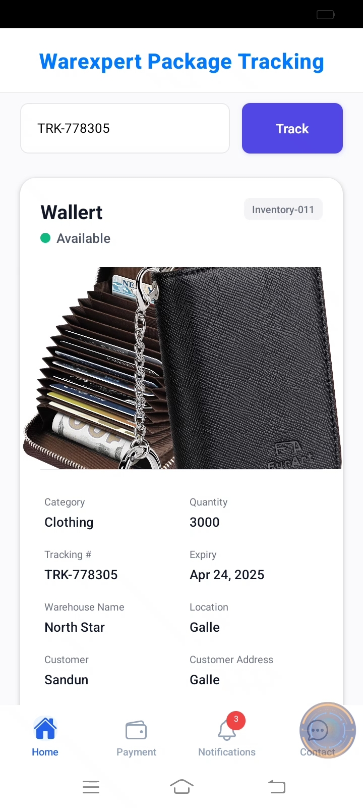
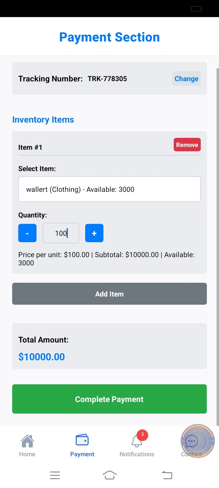
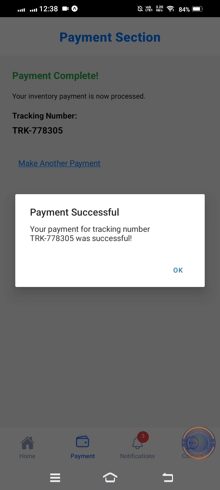
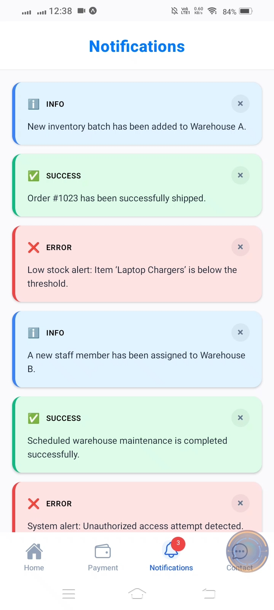
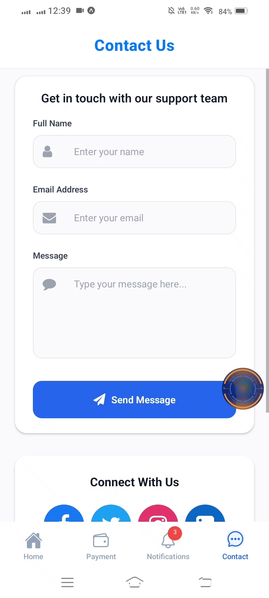

<h1 align="center" id="title"><a href="https://git.io/typing-svg"></a></h1>

<p align="center"></p>

<p id="description">Warexpert Mobile is a comprehensive logistics tracking mobile application built with React Native and Expo. The app enables users to track their packages process payments receive notifications about their shipments and contact customer support—all from a single intuitive interface.</p>

<h2>Project Screenshots:</h2>









  
  
<h2>🧐 Features</h2>

Here're some of the project's best features:

*   Package Tracking: Enter tracking numbers to monitor the status and location of shipments in real-time
*   Payment Processing: Securely pay for inventory items related to tracked packages
*   Notification System: Stay updated with automated alerts about package status changes
*   Customer Support: Easily reach out to support representatives through an integrated contact form

<h2>🛠️ Installation Steps:</h2>

<p>1. Clone the repository:</p>

```
git clone https://github.com/sandundil2002/Warexpert_Mobile.git
```

<p>2. Install dependencies:</p>

```
npm install
```

<p>3. Configure the backend API endpoint in services.ts</p>

```
npx expo start
```

<p>4. iOS</p>

```
Scan the QR code with your device camera or run npx expo run:ios
```

<p>5. Android</p>

```
Scan the QR code with the Expo Go app or run npx expo run:android
```

  
  
<h2>💻 Built with</h2>

Technologies used in the project:

*   Frontend: React Native with Expo
*   State Management: Redux with Redux Toolkit
*   API Communication: Axios
*   Navigation: React Navigation
*   UI Components: React Native Paper

<h2>Backend REST API Repository</h2>

  * For the backend implementation of this project, you can visit the repository <a href="https://github.com/sandundil2002/Warexpert_Backend.git">Warexpert Backend API</a>

<h2>🛡️ License:</h2>

This project is licensed under the MIT License - see the LICENSE file for details.
